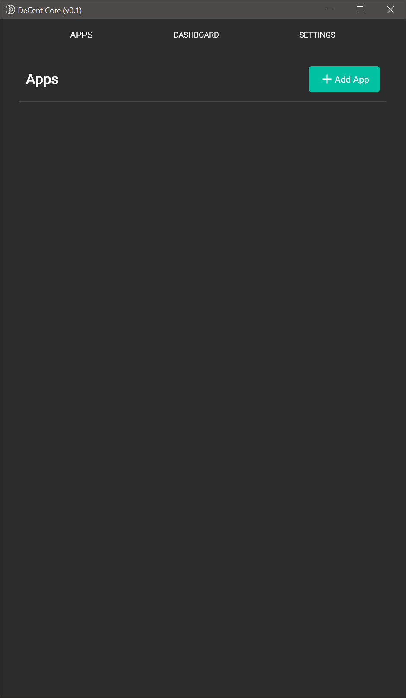
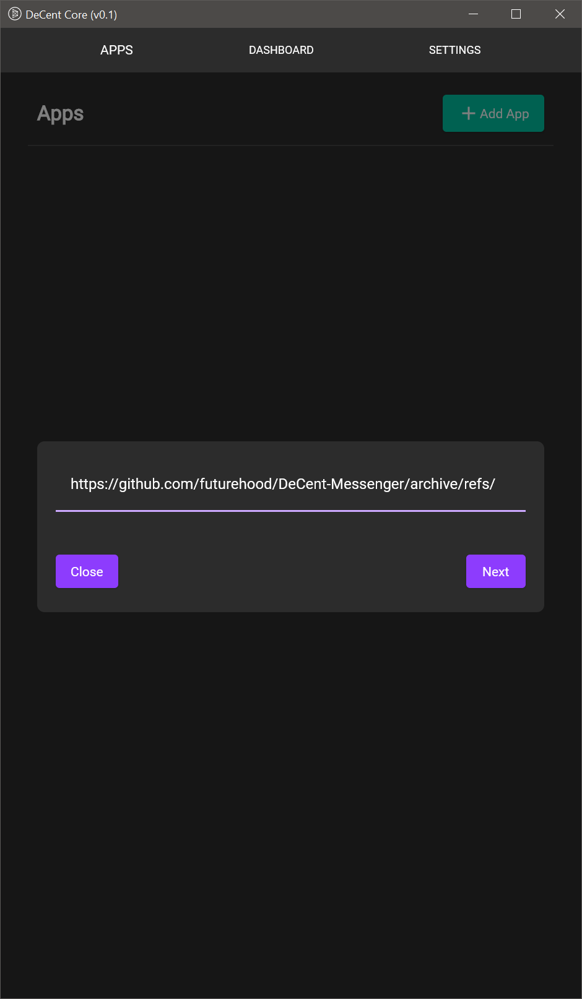
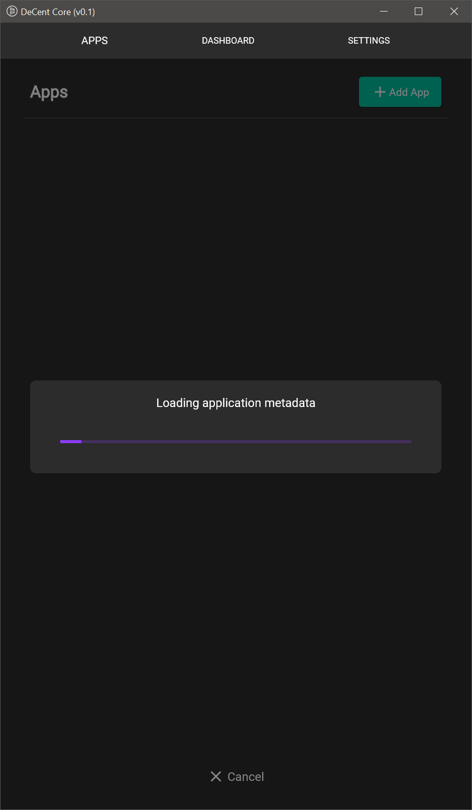
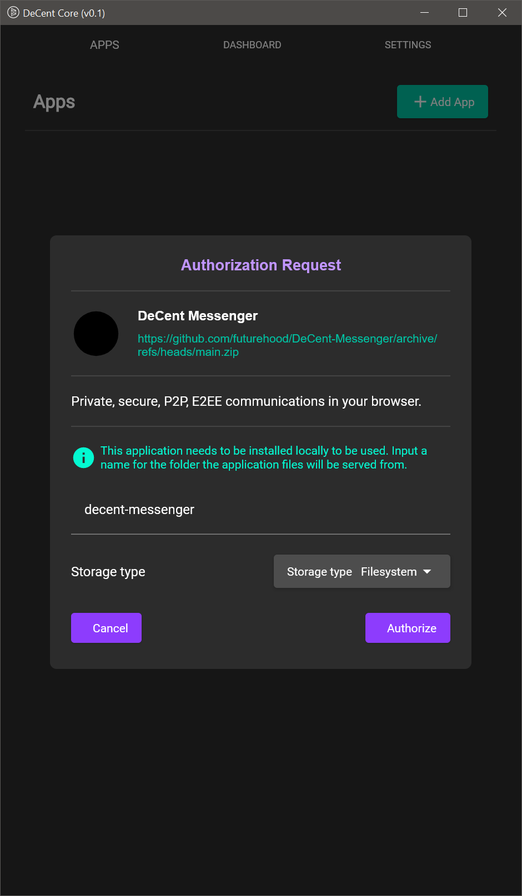
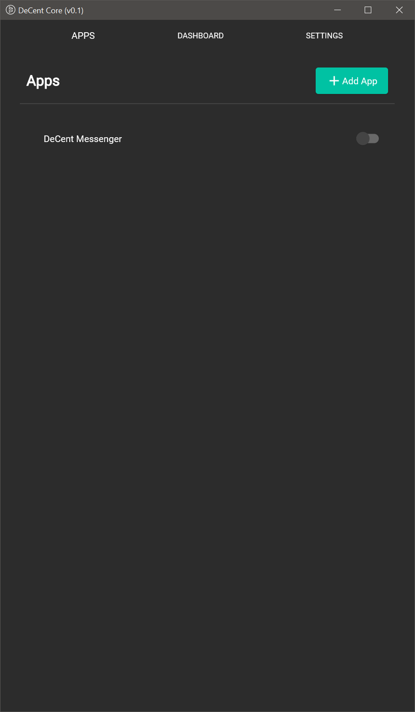
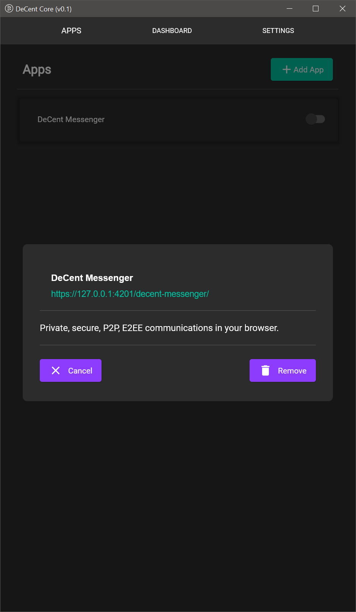

# DeCent-Messenger

## Installation

### Hosted/Demo URL: https://futurehood.github.io/DeCent-Messenger/

### Installation URL: https://github.com/futurehood/DeCent-Messenger/archive/refs/heads/main.zip

To install DeCent Messenger locally using DeCent-Core, follow these steps:

<table>
  <tr>
    <td>
      
    </td>
    <td>
      
    </td>
    <td>
      
    </td>
    <td>
      
    </td>
    <td>
      
    </td>
    <td>
      
    </td>
  </tr>
</table>

1. Open DeCent-Core and navigate to the Apps section. Click *Add App*.
2. Paste the URL of the DeCent-Messenger repository ZIP into the prompt (^above).
3. Wait while DeCent-Core fetches the application files and reads the manifest.
4. Authorize DeCent Messenger when the prompt appears.
5. Now DeCent-Core is installed locally.
6. Manage the installation by opening the app options. The application can also be launched here when the DeCent-Core server is running.
