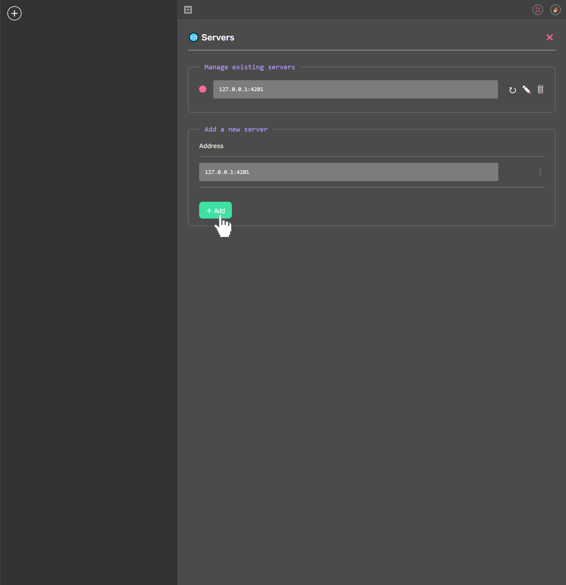
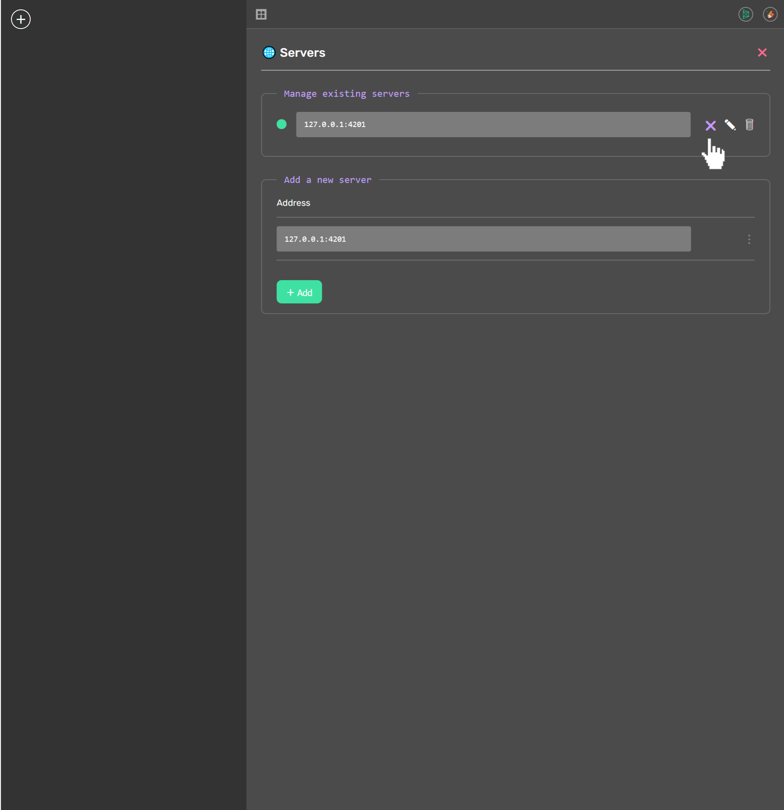

# DeCent-Messenger

## Overview

DeCent Messenger is a web application designed to facilitate perfect privacy in digital communications.

- 100% Decentralized
- Peer-to-peer (P2P) Communication
- End-to-end Encryption (EE2E)

#### Demo URL: https://futurehood.github.io/DeCent-Messenger/

#### Installation URL: https://github.com/futurehood/DeCent-Messenger/archive/refs/heads/main.zip

  

    <h2>Installation Guide</h2>
  

  
To install DeCent Messenger locally using DeCent-Core, follow these steps:

  <table>
    <tr>
      <td>
        
      </td>
      <td>
        
      </td>
      <td>
        
      </td>
      <td>
        
      </td>
      <td>
        
      </td>
      <td>
        
      </td>
    </tr>
  </table>
  <ol>
    <li>Open DeCent-Core and navigate to the Apps section. Use the <b><i>Add App</i></b> button to open the installation dialog.</li>
    <li>Paste the Installation URL of the DeCent-Messenger repository ZIP into the prompt.</li>
    <li>Wait while DeCent-Core fetches the application files and reads the manifest.</li>
    <li>Authorize DeCent Messenger when the prompt appears.</li>
    <li>Now DeCent-Core is installed locally.</li>
    <li>Manage the installation by opening the app options. The application can also be launched here when the DeCent-Core server is running.</li>
  </ol>

  

    <h2>User Guide</h2>
  

  <h3>Contents</h3>
  <ul style="list-style: none; padding: 0;">
    <li>
      <a href="#signing-in">Signing in</a>
    </li>
    <li>
      <a href="#creating-a-profile">Creating a profile</a>
    </li>
  </ul>
  

  <h3 id="signing-in">Signing In</h3>
  
Upon opening the application, you will be prompted to sign in. Select the desired profile to continue. If necessary, create a new profile.

  
  
The <b><i>Remember selection</i></b> option can be used to automatically sign in as specified user in the future.

  
  
Once signed in, the UI will be empty. Everything is ready to go.

  
  

  <h3 id="creating-a-profile">Creating a Profile</h3>
  
To create a profile, use the <b><i>Create a new profile</i></b> button on the Sign In dialog.

  
  
Fill in the details, and use the <b><i>Save</i></b> button to submit the form.

  
  
Sign in using the newly created profile

  
  

  <h3>Managing a Profile</h3>
  
Use the <b><i>Profile Settings</i></b> button in the top right of the UI to open the manage profile dialog.

  
From here, the profile can be signed out, modified, or deleted.

  
  

  <h3>Managing Servers</h3>
  
To manage the servers associated with a profile, sign in to the profile, and use the <b><i>Server Settings</i></b> button to open the manage servers dialog.

  
  
To add a server, enter the host address in the <b><i>Address</i></b> field and use the <b><i>Add</i></b> button to submit the form.

  
  
Once the server has been added, the connection state can be controlled by the <b><i>Toggle Connection State</i></b> button.

  
  
  
  
  
  
  
  

